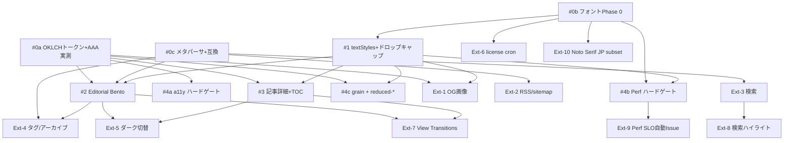

# 08. ロードマップ

## 設計方針

- MVP は **9 Issue**、それ以上に増やさない (Calm の精神を実装側にも適用)
- 拡張は **10 Issue** に整理し、必須に近い 6 件 (Ext-1〜6) と nice-to-have 4 件 (Ext-7〜10) に分類
- 各 Issue は **AC / 依存 / 推定難易度** を持つ
- Visual Regression baseline は **直近 PR が落ち着いた後** に撮影 (master が安定してから)
- Feature flag は **dev / preview のみ flag-on**、本番常時 off。`vite.config.ts` で gate

## MVP 9 Issue

### #0a — OKLCH カラートークン整備 + AAA 実測スクリプト

- **目的**: `02-color-system.md` の primitives を Panda CSS トークン化し、AAA 実測を CI 化する
- **AC**:
  - [ ] `panda.config.ts` の `theme.tokens.colors` / `semanticTokens.colors` に primitives 登録
  - [ ] 既存 Gruvbox はコードハイライト名前空間で残す
  - [ ] `scripts/calculateContrast.ts` が culori 実測で本文 7.20:1 / UI 4.50:1 を要求
  - [ ] `pnpm contrast:check` を `package.json` に追加
  - [ ] CI で contrast:check が必須ステータス
- **依存**: なし
- **難易度**: M

### #0b — フォント Phase 0 検証 (Newsreader 採用判定)

- **目的**: Newsreader VF + JetBrains Mono VF self-host の妥当性を実機サンプルで判定
- **AC**:
  - [ ] `public/fonts/` に Newsreader VF / JetBrains Mono VF 配置 (woff2)
  - [ ] OFL.txt 同梱
  - [ ] 27 枚の比較スクリーンショット (mobile/tablet/desktop × cream-50/cream-100/sumi-950 × 和文 3 候補) を `docs/rfc/editorial-citrus/phase0/` に保存
  - [ ] 5 軸採点シートを記録、合計 20/25 以上で採用、19 以下なら Plan A or B
  - [ ] `font-display: swap` + size-adjust + ascent/descent override が CSS に存在
- **依存**: なし
- **難易度**: L (検証含むため)

### #0c — `## メタ` パーサ + 既存 16 記事互換テスト

- **目的**: `06-data-model.md` の C1〜C8 を満たすパーサと、既存 16 記事互換性テスト
- **AC**:
  - [ ] `src/lib/meta.ts` に `parseMetaSection` 実装、`MetaParseError` 5 種別
  - [ ] T1〜T12 の単体テスト緑
  - [ ] 既存 16 記事すべてが `pnpm build` で parse 成功 (T1)
  - [ ] draft は本番ビルドで除外、開発ビルドで表示
- **依存**: なし
- **難易度**: M

### #1 — Typography textStyles + ドロップキャップ

- **目的**: `03-typography.md` の textStyles を Panda CSS で定義し、ドロップキャップを実装
- **AC**:
  - [ ] `panda.config.ts` の `theme.textStyles` に display / heading / body / meta / code / dropCap 登録
  - [ ] 本文 max-width 36rem、line-height 1.85 が Layout に反映
  - [ ] ドロップキャップは ASCII 先頭段落でのみ、aria-hidden + 隠し span で SR 重複なし
  - [ ] preload Newsreader 1 本のみ、size-adjust / override で CLS < 0.05
- **依存**: **#0b** (採用判定済みであること)
- **難易度**: M

### #2 — Editorial Bento ホーム

- **目的**: `04-layout.md` のホーム Editorial Bento を実装
- **AC**:
  - [ ] Featured (span 6) + Bento 2x2 + Index の構造
  - [ ] 記事不足時 placeholder 自動生成、aria-hidden
  - [ ] mobile では 1 列縦並びに変形
  - [ ] Persimmon-600 の Featured バッジは本ページ 1 箇所のみ
  - [ ] grainy gradient + reduced-transparency 対応
- **依存**: **#0a, #0c, #1**
- **難易度**: L

### #3 — 記事詳細 36rem + Sticky TOC

- **目的**: `04-layout.md` の記事詳細を実装、TOC を 3 段ブレークポイント対応
- **AC**:
  - [ ] 本文 max-width 36rem、`overflow-wrap: anywhere`
  - [ ] desktop ≥ 1280 で TOC 200px sticky、1024〜1279 で 180px
  - [ ] < 1024 (含 < 960) で Disclosure に変形、scroll position guard 動作
  - [ ] IntersectionObserver で現在位置ハイライト + aria-current="location"
- **依存**: **#0a, #1**
- **難易度**: L

### #4a — a11y ハードゲート (axe / contrast / VR baseline)

- **目的**: `07-accessibility-and-performance.md` の G1 / G2 / G5 を CI 化
- **AC**:
  - [ ] `e2e/axe.spec.ts` でホーム / 記事詳細 / 404 を axe-core 検証 (G1)
  - [ ] `pnpm contrast:check` を CI 必須化 (G2)
  - [ ] Playwright VR snapshot baseline 撮影、diff < 0.1% を CI 必須化 (G5)
  - [ ] 必須ステータスとして PR で block する
- **依存**: **#0a**
- **難易度**: L

### #4b — Performance ハードゲート (INP / CLS / Lighthouse)

- **目的**: G3 / G4 / 予算遵守を CI 化、M1 / M2 を non-blocking で観測
- **AC**:
  - [ ] Playwright + web-vitals で INP < 150ms、CLS < 0.05 を ハードゲート (G3 / G4)
  - [ ] HTML / JS / Font / CSS 予算を bundle-analyzer で確認
  - [ ] Lighthouse CI を `continue-on-error` で実行 (M1 / M2)
- **依存**: **#0b, #1**
- **難易度**: M

### #4c — grainy gradient + reduced-motion / transparency 対応

- **目的**: `05-motion-and-delight.md` の grain と prefers-reduced-* 対応を CSS で完結
- **AC**:
  - [ ] `public/textures/grain.png` (≤ 30KB) を配置
  - [ ] light は multiply、dark は screen で blend、opacity 0.06
  - [ ] prefers-reduced-transparency で grain / blur 非表示
  - [ ] prefers-reduced-motion で 5 種モーション停止 / 減衰
  - [ ] focus ring は trail なしで static
- **依存**: **#0a, #1**
- **難易度**: M

## 拡張 10 Issue

### Ext-1 — OG 画像 (Persimmon 単色)

- **AC**: OG 画像生成 (1200×630) で背景 Persimmon-600 単色、白文字でタイトル組版。 build 時に各記事用に静的生成
- **依存**: #0a, #1
- **難易度**: M
- **区分**: 必須に近い

### Ext-2 — RSS / sitemap

- **AC**: `/rss.xml` / `/sitemap.xml` を build 時に生成、status=published のみ
- **依存**: #0c
- **難易度**: S
- **区分**: 必須に近い

### Ext-3 — クライアント検索

- **AC**: タイトル / 本文 / タグ全文インデックスを fuse.js 等で実装、結果件数を ARIA Live で SR に
- **依存**: #0c
- **難易度**: M
- **区分**: 必須に近い

### Ext-4 — タグページ・アーカイブ

- **AC**: `/tags/:tag` ルート、`/archive` 年別アーカイブページ、Index と整合
- **依存**: #0c, #2
- **難易度**: M
- **区分**: 必須に近い

### Ext-5 — ダークモード切替 UI

- **AC**: Header にトグル、`localStorage` 永続化、FOUC 防止 inline script
- **依存**: #2, #3
- **難易度**: S
- **区分**: 必須に近い

### Ext-6 — フォント license check cron (半年)

- **AC**: GitHub Actions で半年ごとに upstream の OFL / Apache 2.0 ライセンス変更検知、自動 Issue 化
- **依存**: #0b
- **難易度**: S
- **区分**: 必須に近い

### Ext-7 — View Transitions

- **AC**: `<ViewTransition>` (React 19) を使ったページ遷移を導入、prefers-reduced-motion で fallback
- **依存**: #2, #3
- **難易度**: M
- **区分**: nice-to-have

### Ext-8 — 検索ハイライト

- **AC**: Ext-3 の結果一覧で一致語にハイライト、本文遷移時にもスクロール + ハイライト
- **依存**: Ext-3
- **難易度**: M
- **区分**: nice-to-have

### Ext-9 — Lighthouse perf SLO 自動 Issue

- **AC**: PSI field (CrUX) M3 が SLO を割った場合に GitHub Issue を自動作成
- **依存**: #4b
- **難易度**: S
- **区分**: nice-to-have

### Ext-10 — Noto Serif JP subset (Plan B 発動時のみ)

- **AC**: Phase 0 採点 14 点以下で発動。subset 80KB 以下で配信
- **依存**: #0b の Plan B 判定
- **難易度**: M
- **区分**: nice-to-have (条件付き)

## 依存関係グラフ



## Feature flag 規約

- 名前空間: `editorial`
- 設定先: `vite.config.ts` の `define` (例: `__EDITORIAL__: JSON.stringify(true)`)
- **dev / preview**: 環境変数 `EDITORIAL=1` で flag-on
- **本番 (master)**: 常時 **off** (production = legacy UI、明示的に切替時のみ on)
- 個別機能 flag は `editorial.bento` / `editorial.toc` 等のドット表記
- flag が落とされた状態でも build / test が通ること (CI で両モード走らせる)

```ts
// vite.config.ts (#2 / #3 で実装)
const editorialOn = process.env.EDITORIAL === "1" || mode === "development";
return {
  define: {
    __EDITORIAL__: JSON.stringify(editorialOn),
    __EDITORIAL_BENTO__: JSON.stringify(editorialOn),
    __EDITORIAL_TOC__: JSON.stringify(editorialOn),
  },
};
```

コードからの参照:

```ts
if (import.meta.env.PROD && !__EDITORIAL__) {
  return <LegacyHome />;
}
return <EditorialBentoHome />;
```

## Visual Regression baseline 撮影タイミング

- **直近 PR (#346〜#350) が落ち着いた直後** に master で 1 度撮影
- 撮影後は **Issue #4a で承認された baseline** を tracked にする
- 各 Issue PR で意図した差分があるなら、PR 内で baseline 更新

## 推定難易度凡例

| 記号 | 想定工数      |
| ---- | ------------- |
| S    | 半日〜1 日    |
| M    | 2〜4 日       |
| L    | 5〜8 日       |
