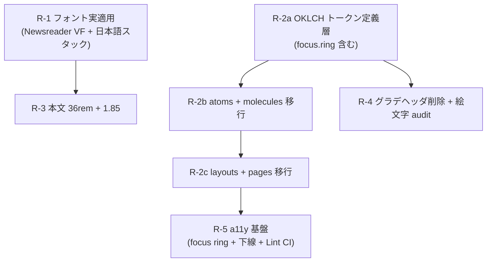

# 10. リニューアル Phase1 計画 (v2)

> **Editorial Citrus デザインリニューアル v2 計画書**
> Phase A 調査 → Phase B-D 設計 → Phase E Devil's Advocate 第 2 ラウンドで **APPROVE WITH MINOR FIXES** 取得済み (軽微修正 4 件反映済)。

## 1. 位置づけ

本ドキュメントは v1 設計 (`01`〜`09`) のうち **Phase1 で実装する範囲** を再定義する第 2 版計画書である。
v1 の MVP は 9 Issue 構成だったが、Phase A 調査 (旧 Gruvbox 残存実測 73 件 / 19 ファイル) と Devil's Advocate ラウンドの結果、

- **Phase1 = Calm + Editorial の最小実装**
- **目玉 (Editorial Bento ホーム / View Transitions API) は Phase2 送り**

として 7 Issue 構成 (R-1 〜 R-5、ただし R-2 を 3 分割) に絞り直した。

v1 の `01-concept-and-personas.md` 〜 `09-glossary-and-decisions.md` は **設計思想の記録** として保持する。実装ロードマップ (`08-roadmap.md`) は v1 履歴として残し、Phase1 着手は本ドキュメントを単一ソースとする。

## 2. Phase A 真の問題と Issue マッピング

Phase A 調査で抽出した Lazy Note の真の問題と、Phase1 で解決する Issue の対応表。

| #   | 真の問題 (Phase A 抽出)                                                              | 解決 Issue          | Phase1 で扱うか |
| --- | ------------------------------------------------------------------------------------ | ------------------- | --------------- |
| P-1 | フォント未適用 (Newsreader VF / 日本語スタックが本番で読めない)                      | R-1                 | ○               |
| P-2 | Gruvbox トークン残存 73 件 / 19 ファイル (`bg.[0-4]` / `fg.[0-4]` / `gruvbox.*`)      | R-2a / R-2b / R-2c  | ○               |
| P-3 | 本文 max-width が広すぎ、line-height も短く読みづらい                                | R-3                 | ○               |
| P-4 | 派手なグラデヘッダと UI 用絵文字が Calm 思想と矛盾                                   | R-4                 | ○               |
| P-5 | focus ring と本文リンク下線の一貫性がなく、CI Lint も無し                            | R-5                 | ○               |
| P-6 | ホームの構造化 (Editorial Bento) ができていない                                      | (Phase2 送り)       | ×               |
| P-7 | ページ遷移の文脈保持がない                                                           | (Phase2 送り)       | ×               |

### Phase A 真の問題サマリ

```text
旧トークン参照 73 件の内訳 (Phase A 実測)
- bg.0 / bg.1 / bg.2 / bg.3 / bg.4 ......... 32 件
- fg.0 / fg.1 / fg.2 / fg.3 / fg.4 ......... 24 件
- token('colors.gruvbox.*')   .............. 12 件
- var(--colors-bg-N)          .............. 5 件
合計 ........................................ 73 件
影響ファイル数 .............................. 19 ファイル
```

R-2a → R-2b → R-2c の 3 段階で 0 件まで削減し、最終 PR で `tokens.colors.gruvbox` および旧 `gradients.*` を `panda.config.ts` から削除する。

## 3. 7 Issue 構成



依存関係まとめ:

- **R-1** と **R-2a** は **並列可** (依存なし)
- **R-2b** は **R-2a** の後
- **R-2c** は **R-2b** の後
- **R-3** は **R-1** の後
- **R-4** は **R-2a** の後 (`gradients.*` 削除を含むため)
- **R-5** は **R-2c** の後 (CI Lint script の最終確認のため)

### R-1: フォント実適用 (Newsreader VF + 日本語スタック)

- **依存**: なし (R-2a と並列可)
- **難易度**: M
- **解決する真の問題**: P-1
- **目的 (Why)**: v1 設計で採用された Newsreader VF + Noto Serif JP スタックを **本番ビルドで実際に適用** し、Calm の語り口に必要な紙面感を担保する。
- **受け入れ基準**:
  - (i) `@font-face` で Newsreader VF を読み込み、`font-display: swap`
  - (ii) `<link rel="preload" as="font" type="font/woff2" crossorigin>` を `index.html` に追加
  - (iii) フォントスタック: `"Newsreader", "Noto Serif JP", "Hiragino Mincho ProN", "Yu Mincho", "YuMincho", serif`
  - (iv) Lighthouse Performance ≥ 90 (PostDetail 1 ページ Mobile、目視確認、CI 化は Phase2)
  - (v) CLS < 0.1 (size-adjust または fallback metric override で対応)
  - (vi) VR baseline 全件 re-generate し、code 変更とは別 PR (`chore/vr-baseline-r1`) で master 反映
- **対象ファイル**: `index.html`, `src/index.css` (or 相当の global), `panda.config.ts` (fonts のみ)
- **スコープアウト**: DropCap, textStyles の prose 詳細, Lighthouse CI gate

### R-2a: トークン定義層 OKLCH 移行

- **依存**: なし (R-1 と並列可)
- **難易度**: M
- **解決する真の問題**: P-2 (定義側)
- **目的 (Why)**: 新しい semantic token を OKLCH で定義し、Phase1 全 Issue が利用できる土台を作る。`focus.ring` トークンも同時に定義 (R-5 で利用)。
- **受け入れ基準**:
  - (i) 新 semantic token (`bg.canvas/surface/elevated`, `fg.primary/secondary/muted`, `accent.link/featured`, `focus.ring`) がすべて `oklch()` で定義
  - (ii) panda.config.ts コンフリクト回避: colors キーのみ編集 (textStyles / fonts は触らず)
  - (iii) WCAG AA 4.5:1 を Token ペアで満たす数値設計を Issue 本文に記載
  - (iv) `pnpm prepare` で styled-system が再生成されエラー無し
  - (v) **[軽微修正1]** 旧トークン名 (`bg.0`〜`bg.4` / `fg.0`〜`fg.4`) を新 OKLCH 近似色のエイリアスとして残し、R-2c 完了後の最終 PR で削除する旨を明記
- **対象ファイル**: `panda.config.ts` (colors キー), `styled-system/` (auto-generate)
- **スコープアウト**: 実 atoms / molecules への適用 (R-2b)、layouts / pages 適用 (R-2c)、`gradients.*` 削除 (R-4)

### R-2b: atoms + molecules UI トークン移行

- **依存**: R-2a
- **難易度**: M
- **解決する真の問題**: P-2 (atoms / molecules 範囲)
- **目的 (Why)**: 旧 Gruvbox トークン (`bg.[0-4]` / `fg.[0-4]` / `gruvbox.*`) 参照を atoms / molecules で 0 件にする。
- **受け入れ基準**:
  - (i) `src/components/atoms/*` + `src/components/common/*` で旧 `bg.[0-9]` `fg.[0-9]` `gruvbox` 参照が `git grep` で 0 件 (該当範囲)
  - (ii) 主要 atoms 各 1 件で WCAG AA 達成 (Button hover / Link / Typography)
  - (iii) VR (該当ファイルの snapshot) 差分が意図通り
- **対象ファイル**: `src/components/atoms/*`, `src/components/common/*`
- **スコープアウト**: layouts / pages の移行 (R-2c)、`tokens.colors.gruvbox` 削除 (R-2c の AC)

### R-2c: layouts + pages UI トークン移行

- **依存**: R-2b
- **難易度**: M
- **解決する真の問題**: P-2 (全範囲)
- **目的 (Why)**: 旧 Gruvbox トークン参照を `src/` 全体で 0 件にし、`panda.config.ts` から `tokens.colors.gruvbox` および旧 `gradients.*` を削除する。
- **受け入れ基準**:
  - (i) `src/` 全体で旧 Gruvbox トークン参照が `git grep` 0 件
  - (ii) panda.config.ts から `tokens.colors.gruvbox` および旧 `gradients.*` を **削除**
  - (iii) 主要 5 ページで WCAG AA 4.5:1
  - (iv) CI Lint script (R-5) が 0 件で通る (R-5 後の最終確認)
- **対象ファイル**: `src/layouts/*`, `src/pages/*`, `panda.config.ts`
- **スコープアウト**: focus ring / リンク下線 / CI Lint (R-5)

### R-3: 本文 max-width 36rem + line-height 1.85

- **依存**: R-1
- **難易度**: S
- **解決する真の問題**: P-3
- **目的 (Why)**: 紙面組版の標準値 (1 行 70 字程度) を本文に適用し、長文記事の可読性を担保する。
- **受け入れ基準**:
  - (i) 本文コンテナの `max-width` が 36rem (576px)
  - (ii) `line-height` が 1.85
  - (iii) 既存の見出し / リスト / blockquote / pre / code はトークン整理のみ (新規装飾なし)
  - (iv) VR snapshot 差分が意図通り
- **対象ファイル**: `src/pages/posts/*` (PostDetail 本文コンテナ)、関連 layout コンポーネント
- **スコープアウト**: DropCap, Sticky TOC, 段組み

### R-4: グラデヘッダ削除 + 絵文字 audit 全削除

- **依存**: R-2a
- **難易度**: M
- **解決する真の問題**: P-4
- **目的 (Why)**: Calm 思想に矛盾する派手なグラデヘッダと UI 用絵文字を排除する。
- **受け入れ基準**:
  - (i) `panda.config.ts` の `gradients.*` を削除 (またはミニマルな置換)
  - (ii) `grep -rP '[\x{1F300}-\x{1FAFF}\x{2600}-\x{27BF}]' src/` で 0 件 (UI 用絵文字)
  - (iii) 必要箇所は Lucide または抽象記号に置換
  - (iv) Calm の RFC 思想と整合確認 (Issue 本文に対応根拠記載)
- **対象ファイル**: `panda.config.ts`, `src/components/**/*` (絵文字使用箇所)
- **スコープアウト**: 記事本文 (datasources/*.md) の絵文字 (本文の表現は対象外)

### R-5: a11y 基盤 (focus ring 利用 + リンク下線 + CI Lint)

- **依存**: R-2c
- **難易度**: M
- **解決する真の問題**: P-5
- **目的 (Why)**: WCAG 2.4.7 visible focus と本文リンク下線の一貫性を実現し、旧トークン retrograde 防止のため CI Lint script を導入する。
- **受け入れ基準**:
  - (i) 全インタラクティブ要素 (button / a / input) で 2px 以上の visible focus ring (WCAG 2.4.7、`focus.ring` トークン使用、R-2a で定義済)
  - (ii) PostDetail 本文の `<a>` が下線あり、Header/Footer ナビは下線なしで一貫
  - (iii) **[軽微修正3]** `pnpm lint:tokens` (新規 script) が CI でブロッカー化され、検知パターンを少なくとも 3 系統 (`bg.N` / `token('colors.bg.N')` / `var(--colors-bg-N)`) を網羅し、旧トークン参照で fail
  - (iv) prefers-reduced-motion: reduce 時 transition / focus アニメ無効化 (inline @media)
- **対象ファイル**: `src/components/atoms/*` (focus 共通化)、`scripts/lint-tokens.*` (新規)、`.github/workflows/*` (CI gate)、`package.json` (`lint:tokens` script)
- **スコープアウト**: skip link, landmark 強化, axe full sweep (Phase2)

## 4. CI Lint script 設計 (R-5 詳細)

旧トークン retrograde 防止のための新規 `pnpm lint:tokens` script の設計。

### 検知パターン (3 系統最低)

| 系統 | パターン                                | 例                                  |
| ---- | --------------------------------------- | ----------------------------------- |
| 1    | プロパティ値の生 token 参照             | `bg.0`, `bg.1`, ..., `fg.4`         |
| 2    | `token()` 関数経由の参照                | `token('colors.bg.0')`              |
| 3    | CSS 変数経由 (auto-generated 参照)      | `var(--colors-bg-0)`                |

### 実装方針

```ts
// scripts/lint-tokens.ts (R-5 で実装)
const PATTERNS = [
  /\bbg\.[0-9]\b/g,
  /\bfg\.[0-9]\b/g,
  /token\(['"]colors\.bg\.[0-9]['"]\)/g,
  /token\(['"]colors\.fg\.[0-9]['"]\)/g,
  /var\(--colors-bg-[0-9]\)/g,
  /var\(--colors-fg-[0-9]\)/g,
  /token\(['"]colors\.gruvbox\.[a-z0-9-]+['"]\)/g,
];
// `src/**/*.{ts,tsx,css}` を走査、ヒット 0 件で exit 0、それ以外で exit 1
```

### CI 統合

```yaml
# .github/workflows/lint.yml (R-5 で追記)
- name: Lint design tokens (legacy Gruvbox prohibition)
  run: pnpm lint:tokens
```

CI でブロッカーステータス化する。

## 5. Phase2 送りリスト (優先順位明示)

Phase A〜D で議論された機能のうち、Phase1 では扱わず Phase2 以降で再検討する項目。

### 目玉 2 トップ (Phase2 着手時の優先度 S)

1. **Editorial Bento ホーム** (Featured + 2x2 + Index、構造化レイアウト) — v1 #2 の本来の目玉。R-2c で土台が整ってから。
2. **View Transitions API** (Cross-document、Hero morph) — v1 Ext-7 から昇格。

### その他 (優先度順)

3. Sticky TOC (responsive + scroll position guard)
4. ドロップキャップ (ASCII 段落限定、aria-hidden 戦略)
5. grain PNG + reduced-transparency
6. Performance gate full (CI blocker / SI / LCP / TBT 個別閾値)
7. Skip link + landmark 強化
8. Storybook 導入
9. Biome custom lint rules v2 化
10. Sticky TOC scroll position guard
11. 段組み・マルチカラム本文

## 6. 妥協点 6 件

Phase D-E で確定した「Phase1 では妥協する」項目の記録。

| #   | 項目                                            | 妥協内容                                                                                       | 理由                                                          |
| --- | ----------------------------------------------- | ---------------------------------------------------------------------------------------------- | ------------------------------------------------------------- |
| C-1 | コントラスト基準を AAA → AA に緩和              | v1 で謳った AAA 7:1 を、Phase1 では WCAG AA 4.5:1 に緩める                                     | 設計と実装の乖離を縮める。AAA は Phase2 で再設計              |
| C-2 | Newsreader Phase 0 採点フローの省略             | 27 枚スクリーンショット採点を行わず、目視 1 ページの Lighthouse ≥ 90 のみで採用判定            | コスト過大。Phase A で実用確認済み                            |
| C-3 | grain PNG / reduced-transparency 対応 Phase1 不採用 | v1 #4c の grain は Phase2 送り                                                                 | Calm の最小実装に集中するため                                 |
| C-4 | INP / CLS ハードゲート Phase1 不採用            | v1 G3 / G4 をやめ、CLS < 0.1 のみ目視確認                                                      | CI 整備コストが大きい。Phase2 で full gate                    |
| C-5 | View Transitions Phase1 不採用                  | Ext-7 を Phase2 目玉 2 トップに昇格                                                            | Phase1 の範囲を逸脱。R-2c 完了後に着手したい                  |
| C-6 | 旧 `bg.[0-4]` / `fg.[0-4]` エイリアス温存        | R-2a で定義時点ではエイリアス維持、R-2c 完了後の最終 PR で削除                                 | R-2b 進行中の互換性確保 (軽微修正1 反映)                      |

## 7. DA APPROVE WITH MINOR FIXES の経緯

Phase E Devil's Advocate 第 2 ラウンドで指摘された 4 件の軽微修正を反映済み。

| 修正 # | 指摘内容                                                                  | 反映先                                                       |
| ------ | ------------------------------------------------------------------------- | ------------------------------------------------------------ |
| 1      | 旧トークン削除タイミングを明示せよ                                        | R-2a AC (v) に「R-2c 完了後の最終 PR で削除」を明記          |
| 2      | `focus.ring` トークン定義タイミングが R-5 まで遅れていると焦らせる        | R-2a AC (i) で `focus.ring` を最初から定義に含める           |
| 3      | CI Lint script の検知パターンが曖昧                                       | R-5 AC (iii) で 3 系統最低の網羅を明記、本ドキュメント §4 で詳細化 |
| 4      | Phase2 送りの優先度が不明                                                 | 本ドキュメント §5 で「目玉 2 トップ + その他 9 項目」を明示  |

第 2 ラウンドの判定: **APPROVE WITH MINOR FIXES** (上記 4 件反映で APPROVE 確定)。

## 8. 非ゴール

Phase1 で **明示的に扱わない** こと:

- 既存 16 記事 (`datasources/*.md`) の改変
- DropCap (Phase2 送り)
- Editorial Bento ホーム (Phase2 送り)
- Sticky TOC (Phase2 送り)
- View Transitions (Phase2 送り)
- Lighthouse CI gate (Phase2)
- Storybook 導入 (Phase2)
- ダークモード再設計 (Ext-5 で実装済み、本リニューアルでは追加変更しない)

## 9. 関連ドキュメント

- v1 概念: `01-concept-and-personas.md`
- v1 カラー設計: `02-color-system.md` (OKLCH 数値設計のソース)
- v1 タイポ設計: `03-typography.md` (Newsreader 採用根拠)
- v1 ロードマップ: `08-roadmap.md` (履歴として保管)
- v1 用語集: `09-glossary-and-decisions.md`
